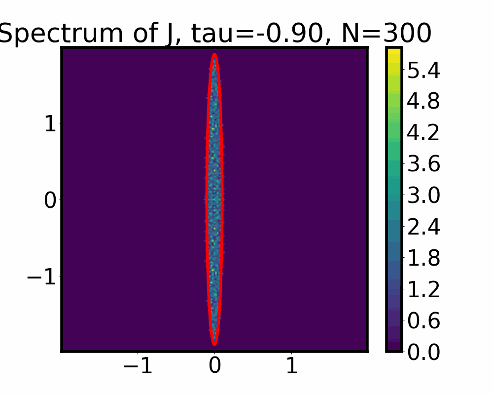

# Generalized Wigner's Semicircle Law for Large Random Asymmetric Matrices

Rajat Dwaraknath and Jerry Liu.

Term paper for AP 229: Statistical Mechanics of Learning and Computation, Spring 2024.

Reproducing results of the paper: [Sommers, Hans Juergen, et al. "Spectrum of large random asymmetric matrices." Physical review letters 60.19 (1988): 1895.](https://journals.aps.org/prl/pdf/10.1103/PhysRevLett.60.1895).

## Sample NxN real matrix $J$ with stats:

$\mathbb{E}[J] = 0$

$\mathbb{E}[J_{ij}^2] = 1/N$

$\mathbb{E}[J_{ij}J_{ji}] = \tau / N, \forall i \neq j$

We get the following spectra

The red ellipses are the predictions of the generalized Wigner's semicircle law.
